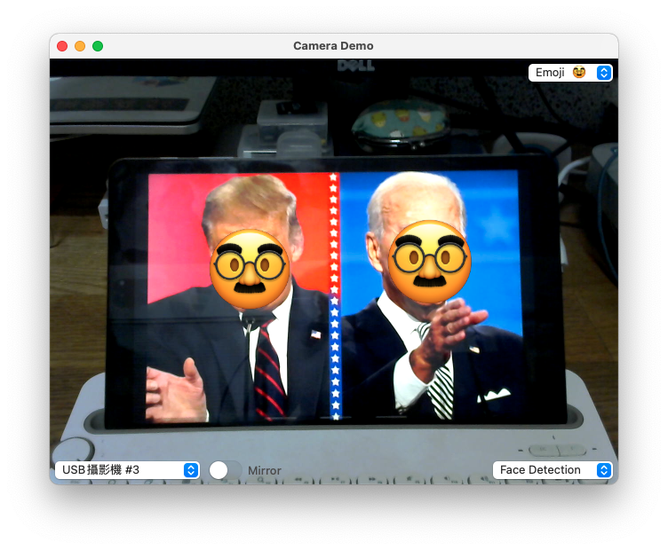
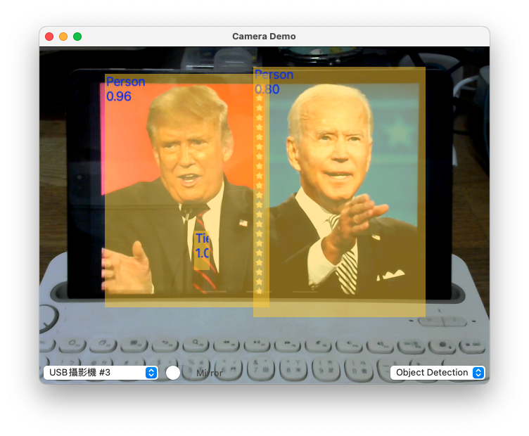
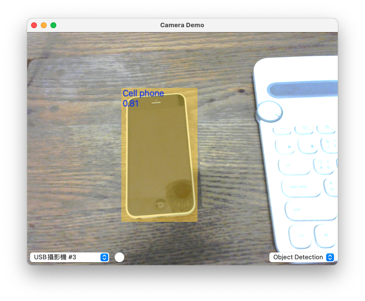
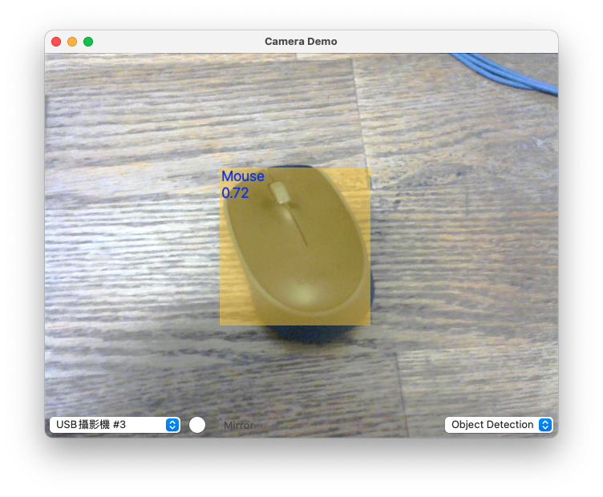

# Camera Demo App for macOS

- 使用 AV Foundation 存取 Webcam。
- 使用 Vision framework 做人臉檢測。
- 使用 YOLOv3-Tiny 做 Object 檢測。

## App 擷圖

### 人臉檢測，並加上 Emoji：

### Object 檢測：

## 說明

- Object 檢測是使用 Apple Inc. 訓練好的 YOLOv3-Tiny mlmodel 檔案（ [下載網址](https://developer.apple.com/machine-learning/models/) ）。
- 我使用的是 16 bit 精度的 YOLOv3TinyFP16.mlmodel，如果你想要有更精確的檢測結果，可自行把 model 換成 32 bit 精度的 YOLOv3Tiny.mlmodel；或是你想要有更快的檢測速度，那就把 model 換成 8 bit 的 YOLOv3TinyInt8LUT.mlmodel。

